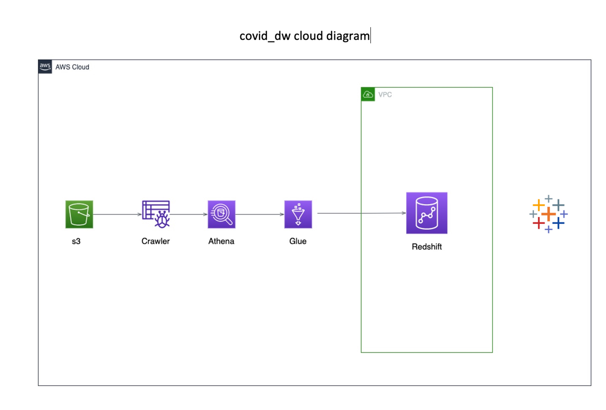
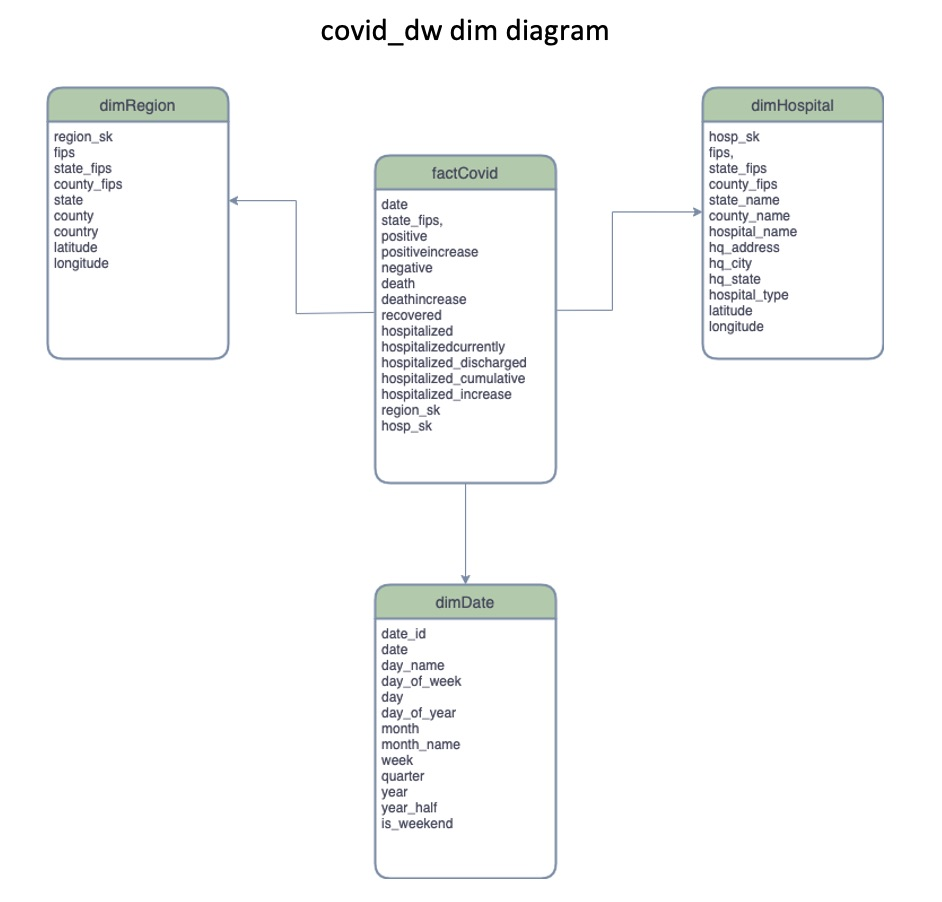
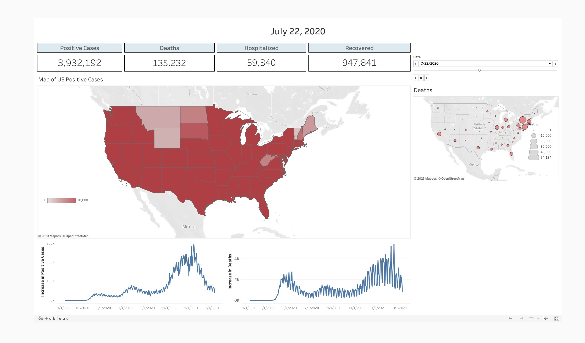

# covid-aws-de

AWS Redshift Data Warehouse for COVID-19 data

This project creates a AWS Redshift Data Warehouse with data pulled down from
the AWS Registry of Open Data [COVID-19 Data Lake](https://covid19-lake.s3.amazonaws.com/index.html). The data
is then exported from the data warehouse to create a [tableau dashboard](https://public.tableau.com/app/profile/joseph.hernandez8168/viz/Covid-DE-Dashboard/Dashboard1).

## <ins>AWS Cloud Diagram</ins>

## <ins>Redshift DW Dimensional Model</ins>

## <ins>Covid Dashboard</ins>

](https://public.tableau.com/app/profile/joseph.hernandez8168/viz/Covid-DE-Dashboard/Dashboard1)
